<picture>
  <source media="(prefers-color-scheme: dark)" srcset="./dark.svg">
  <source media="(prefers-color-scheme: light)" srcset="./light.svg">
  
</picture>

## About

Data Engineer with 1+ year of experience building ETL/ELT pipelines, lakehouse data models, BI dashboards and AI agents on Azure, Databricks, Snowflake, Microsoft Fabric and AWS for healthcare, fintech and retail clients. I have also built and shipped two full-stack AI SaaS products.

**Focus**

- Lakehouse and medallion data platforms on Databricks, Snowflake and Microsoft Fabric
- AI agents with Databricks Genie, Mosaic AI Agent Framework and Microsoft Copilot Studio
- Full-stack AI SaaS with Next.js and RAG
- 500+ data structure and algorithm problems solved

## Experience

**Data Engineer** · Ascendion Engineering Pvt Ltd · Chennai, India · Jul 2025 – Present

Build data pipelines, lakehouse models and AI agents on Azure, Databricks, Snowflake and AWS for healthcare, fintech and retail clients. Delivered end-to-end data workflows within SLA, reducing onboarding ramp-up time by ~30%.

| Project | What I built | Stack |
| --- | --- | --- |
| **DRAI: Data Readiness for AI** Sep 2026 – Present | A framework that scores any dataset on 15 data-readiness dimensions and returns one weighted AI-readiness score with Pass / Review / Fail verdicts. Streamlit app on Databricks Apps with Claude-generated remediation guidance. | Databricks, PySpark, Delta Live Tables, MLflow, Unity Catalog |
| **Multi-Agent Price Lineage** Aug – Sep 2026 | Retail PoC: real-time pricing-event pipeline, root-cause lineage tables in Unity Catalog, two Genie Spaces and a Mosaic AI supervisor agent behind a Streamlit chat app. | Databricks, Kafka, Elasticsearch, AWS EC2, PySpark |
| **Aviation Analytics Medallion Platform** Jul – Aug 2026 | Bronze / Silver / Gold platform (8 dimensions, 6 facts) with 13 + 14 stored procedures, SCD Type 1 and incremental UPSERTs; migrated from Redshift to Snowflake. | Amazon Redshift, Snowflake, SQL |
| **Healthcare Data Harmonization** Oct 2025 – Apr 2026 | SQL KPI views, Power BI reporting and AI agents on AAVA and Copilot Studio; the rebuilt agent reached ~95%+ success rate with 100% SLA compliance. | SQL, Power BI, Copilot Studio, Dataverse |
| **Energy Consumption Forecasting** Jul – Oct 2025 (training) | Medallion pipeline in a Fabric Lakehouse with PySpark and 4–5 Power BI dashboards. | Microsoft Fabric, PySpark, Power BI |

## Featured Projects

- **AI SaaS Platform: RAG repository analysis** (Next.js 15, Gemini AI, Clerk, NeonDB, Firebase, Stripe, Vercel) — RAG-based GitHub repository analysis that cut discovery time by 70%, on a multi-tenant architecture supporting 100+ users.
- **EchoMail AI: AI email SaaS** (Next.js, Prisma, OpenAI GPT, Stripe) — cut response time by 65% across 50K+ emails, with categorization at 95% accuracy.
- **[Sentiment Analysis using BERT](https://github.com/SAISURYACHAITANYAGATTREDDI/SENTIMENTAL-ANALYSIS-USING-BERT)** — Amazon reviews classifier with 95.02% accuracy, 95.04% F1 and 98.81% ROC AUC.

## Engineering Stack

| | |
| --- | --- |
| **Languages** | Python · SQL · PySpark · Java · C++ · C · R |
| **Data engineering** | Databricks (Delta Lake, Unity Catalog, Delta Live Tables) · Microsoft Fabric · Azure Data Factory · Snowflake · Amazon Redshift · Medallion architecture |
| **Cloud and streaming** | Azure · AWS (EC2) · Apache Kafka · Logstash · Elasticsearch |
| **BI and databases** | Power BI · SQL Server · PostgreSQL · Firebase |
| **Web and AI** | Next.js · REST APIs · Prisma · Stripe · RAG · LLM applications · Databricks Genie · Mosaic AI Agent Framework · Copilot Studio |
| **Machine learning** | BERT · MLflow · Databricks AutoML |

## Certifications

- **SnowPro Associate: Platform** (Snowflake), Feb 2026, valid until Feb 2028
- **Databricks Accredited: Databricks Fundamentals**, Sep 2025
- **Snowflake Ascent Platform Training (APAC)**, completed
- **Maven Silicon Certified VLSI Design Methodologist**

## Education

**B.Tech, Electronics and Communication Engineering** · Vellore Institute of Technology, Chennai · 2021 – 2025 · CGPA 9.06

## GitHub Activity

  <picture>
    <source media="(prefers-color-scheme: dark)" srcset="https://raw.githubusercontent.com/SAISURYACHAITANYAGATTREDDI/SAISURYACHAITANYAGATTREDDI/output/github-snake-dark.svg">
    <source media="(prefers-color-scheme: light)" srcset="https://raw.githubusercontent.com/SAISURYACHAITANYAGATTREDDI/SAISURYACHAITANYAGATTREDDI/output/github-snake.svg">
    
  </picture>

## Connect

Open to **Data Engineer** and **SDE** roles.

[GitHub](https://github.com/SAISURYACHAITANYAGATTREDDI) · [LinkedIn](https://www.linkedin.com/in/sai-suryachaitanya-gattreddi-40217b2b3) · [LeetCode](https://leetcode.com/u/SURYA_1828/) · [GeeksforGeeks](https://www.geeksforgeeks.org/user/surya1828/) · [Coding Ninjas](https://www.naukri.com/code360/profile/532cf872-b151-45af-89f0-427b840ec55f) · [Portfolio](https://surya-portfolio-seven-drab.vercel.app) · [Email](mailto:saisuryachaitanyagattreddi@gmail.com)
